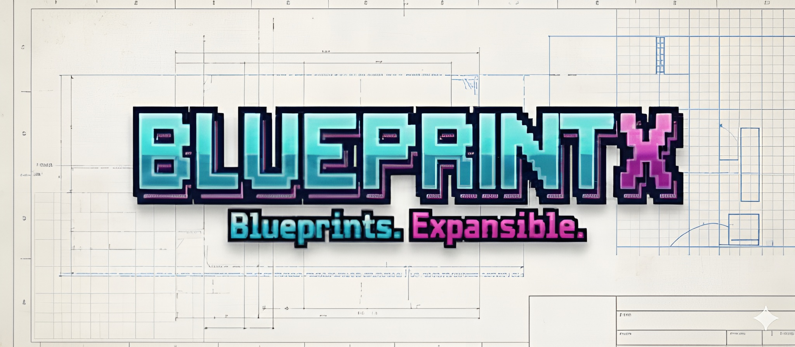

<!-- markdownlint-disable MD013 -->
# BlueprintX 

[](https://www.repostatus.org/#active)


**BlueprintX** is a lightweight scaffolding tool (Make + bash) for creating ready-to-code projects. It is language-agnostic by design.

## ✨ Highlights
- Interactive CLI (`make new`) with skeleton choice
- Ready-made skeletons (currently Python): **DDD service (Native DB)**, **DDD service (ORM DB)** with SQLAlchemy, and **lib-minimal**
- Common Python baseline: templated `pyproject.toml`, pre-commit, VS Code settings, CI workflow, CODEOWNERS, PR template, and test folders (unit/integration/performance)
- Dev/preview modes: temp scaffolds, dry-run structure previews, optional auto-clean

## 🚀 Quick start

```bash
make new          # interactive scaffolder
make preview      # show skeleton structures
make dev          # scaffold into a temp dir (kept)
make dev-clean    # scaffold into temp dir and auto-delete on exit
make dry-run      # print structure; no files written
make docs_server  # serve this docs site locally at http://0.0.0.0:8000
```

Requirements: `bash` ≥ 4. For the current Python skeletons, use `pyenv`/`poetry` (or your Python toolchain of choice) in the generated project.

## 🏗️ Supported skeletons

### DDD service — Native DB (templates/ddd-service-native-db)
Domain-Driven Design service skeleton with hexagonal/ports-and-adapters structure. Uses **native database libraries** (psycopg2, sqlite3, cx_Oracle, pyodbc, pymysql) for direct DB access. `chassis/` holds shared cross-cutting providers; `capabilities/<feature>/` hosts each bounded context's domain, application layer, and adapters.

```
project/
    src/
        chassis/
            db/domain/ports.py            # DatabaseHandler ABC
            db_schema/
                domain/
                infrastructure/           # sqlite, postgres, mariadb, mysql, mssql, oracle
                application/              # build_database_handler() factory
            db_wschema/
                infrastructure/           # json, csv, joblib handlers + SanityCheck
                application/              # build_storage_handler() factory
            typing/                       # ABCTypeCheckerMeta, ProtocolTypeCheckerMeta
        capabilities/
            example_feature/
                domain/                   # entities, DTOs, enums, Protocol ports
                application/              # use-cases, factories
                infrastructure/           # repositories implementing domain ports
        app/
            bootstrap.py                  # env loading, logging, timing
            container.py                  # composition root (AppContainer)
        config/
            startup.py                    # logger, webhooks, runtime constants
        main.py
    tests/{unit,integration,performance}/
    container/
    bin/
    assets/
    docs/
    .github/
    .vscode/
    .env
    pyproject.toml
    requirements.txt
    README.md
```

### DDD service — ORM DB (templates/ddd-service-orm-db)
Same DDD hexagonal structure, but uses **SQLAlchemy ORM (≥ 2.0)** for database operations. Works with PostgreSQL, MySQL, SQLite, Oracle, and MSSQL through a unified `DatabaseSession` / `Repository` ABC.

```
project/
    src/
        chassis/
            db_schema/
                domain/
                infrastructure/
                    base.py          # Base (DeclarativeBase) + DatabaseSession + Repository ABC
                    models.py        # ORM models
                    repository.py    # SQLAlchemyRecordRepository (generic reference impl)
                application/         # build_database_session() factory
            typing/
        capabilities/
            example_feature/
                domain/
                application/
                infrastructure/
        app/
        config/
        main.py
    tests/{unit,integration,performance}/
    ... (same structure as native-db)
```

### lib-minimal
Lean library starter: package under `src/<project_name>/`, tests, CI, VS Code config, and pre-commit ready to go.

```
project/
    src/<project_name>/
    tests/{unit,integration,performance}/
    docs/
    container/
    bin/
    .github/
    .vscode/
    .env
    pyproject.toml
    README.md
```

## 🧭 Folder attribution (ddd-service templates)
- `chassis/`: shared cross-cutting providers (DB handlers, storage, type enforcement).
- `chassis/db/`: `DatabaseHandler` ABC — contract all backends implement.
- `chassis/db_schema/`: SQL-backed handlers + `build_database_handler()` factory.
- `chassis/db_wschema/`: schema-less handlers (JSON, CSV, joblib) + `build_storage_handler()`.
- `chassis/typing/`: runtime type enforcement (`ABCTypeCheckerMeta`, `ProtocolTypeCheckerMeta`).
- `capabilities/<feature>/domain/`: feature entities, DTOs, enums, `Protocol` ports.
- `capabilities/<feature>/application/`: use-case orchestration; no I/O or framework code.
- `capabilities/<feature>/infrastructure/`: adapters implementing domain ports.
- `app/`: `bootstrap.py` (env/logging) + `container.py` (composition root).
- `config/`: module-level singletons and YAML config; secrets stay in `.env`.

## 📂 Repo layout (this tool)

```
BlueprintX/
├── Makefile                 # entry targets: new, preview, dev, dev-clean, dry-run
├── run.sh                   # same targets for non-make usage
├── bin/
│   ├── blueprintx.sh        # interactive menu + modes
│   ├── preview.sh           # skeleton previews
│   ├── help.sh              # usage tips and targets
│   ├── init_venv.sh         # convenience venv bootstrap
│   └── scaffold/            # per-skeleton scaffolders
│       ├── python_ddd_service.sh      # native DB scaffold
│       ├── python_ddd_service_orm.sh  # SQLAlchemy ORM scaffold
│       └── python_lib_minimal.sh
├── templates/               # skeleton contents
│   ├── ddd-service-native-db/  # DDD/hexagonal with native DB libraries
│   ├── ddd-service-orm-db/     # DDD/hexagonal with SQLAlchemy ORM
│   ├── lib-minimal/            # minimal library template
│   └── python-common/          # shared assets for all Python projects
├── docs/                    # mkdocs sources
├── mkdocs.yml               # mkdocs config
└── assets/logo.png          # logo used in this README
```

## 👨‍💻 Authors

**Guilherme Rodrigues**  
[](https://github.com/guilhermegor)  
[](https://www.linkedin.com/in/guilhermegor/)

## 🔗 Useful Links

* [GitHub Repository](https://github.com/guilhermegor/BlueprintX)

* [Issue Tracker](https://github.com/guilhermegor/BlueprintX/issues)

## 🤝 Contributing
Issues and PRs are welcome. Please keep templates minimal, opinionated, and consistent across skeletons.

## 📜 License
MIT. See [LICENSE](LICENSE).
