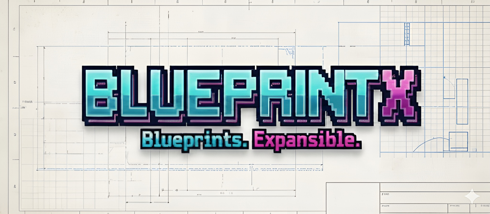

# **Home**

Lightweight scaffolding tool (Make + bash) for creating ready-to-code projects. It is language-agnostic by design.

📦 **GitHub Repository:** [github.com/guilhermegor/blueprintx](https://github.com/guilhermegor/blueprintx)

!!! info "Who this is for"
    Anyone scaffolding a new Python or TypeScript project who wants CI, pre-commit, tests, and
    docs wired in from the first commit — without hand-assembling that tooling per project.

---

## Where to start

| If you want to… | Read |
|---|---|
| Scaffold a project right now | [Get Started](get-started.md) |
| See a skeleton's code before choosing one | [Examples](examples.md) |
| Look up a `make` or `blueprintx` command | [CLI Reference](cli-reference.md) |
| Something broke while wiring docs or assets | [Troubleshooting](troubleshooting.md) |
| Add a skeleton or open a pull request | [Contributing](contributing.md) |

---

## Python scaffolds
- DDD Service (Native DB): Domain-Driven Design, hexagonal service skeleton with per-feature capabilities and shared chassis infrastructure. Uses native database libraries (psycopg, sqlite3, oracledb, etc.). See [DDD Service (Native DB)](py-ddd-service-native-db.md).
- DDD Service (ORM DB): Same DDD/hexagonal structure, but uses SQLAlchemy ORM for database operations. See [DDD Service (ORM DB)](py-ddd-service-orm-db.md).
- MVC Service (Native DB): Layered Model–View–Controller skeleton for script/pipeline-style projects, using native DB drivers (sqlite3, psycopg, mysql-connector, pyodbc, oracledb). See [MVC Service (Native DB)](py-mvc-service-native-db.md).
- MVC Service (ORM DB): Same flat MVC structure, but the model uses the SQLAlchemy ORM. See [MVC Service (ORM DB)](py-mvc-service-orm-db.md).
- Lib Minimal: lean library starter with packaging, tests, and CI ready. See [Lib Minimal](py-lib-minimal.md).

## TypeScript scaffolds
- React SPA (Webpack): Single-page application using React 19, TypeScript 6, Webpack 5, Babel, ESLint (flat config), and Prettier. Src directories pre-created for components, pages, contexts, models, routers, utils, and more. See [React SPA (Webpack)](ts-react-spa-webpack.md).

## View these docs locally (Poetry)
**Option A (direct)**
1. Install docs deps: `poetry install --with docs`
2. Serve with live reload: `poetry run mkdocs serve -a 0.0.0.0:8000 --livereload`
3. Build static site: `poetry run mkdocs build`

**Option B (Make recipe)**
1. `make mkdocs_serve` (installs docs deps, serves with live reload)

For a one-off static build, use Option A's `poetry run mkdocs build`.

## Scaffolder quick reference
- Interactive menu: `make new`
- Preview structures: `make preview`
- Temp sandbox: `make dev` or `make dev_clean`
- Structure-only preview: `make dry_run`

Each scaffold copies shared assets from a common template directory (`templates/python-common` for Python, `templates/ts-common` for TypeScript) and then applies its skeleton-specific layout. New skeletons are discovered automatically via `skeleton.meta` files — no changes to the menu code needed.
